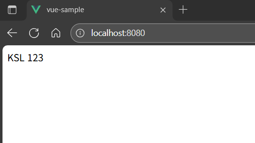
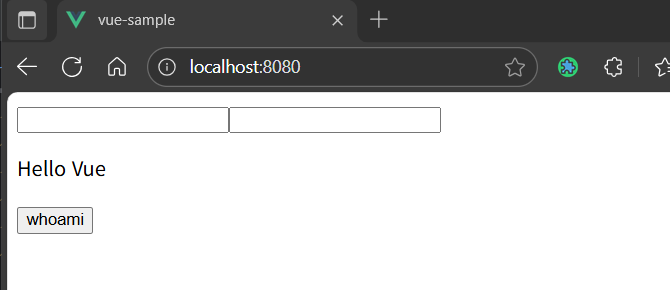
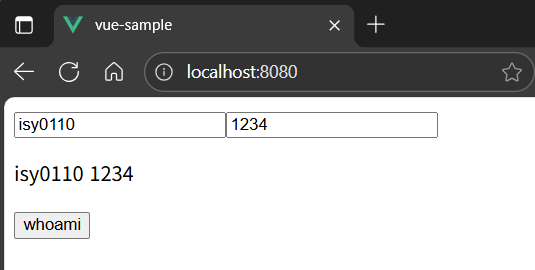
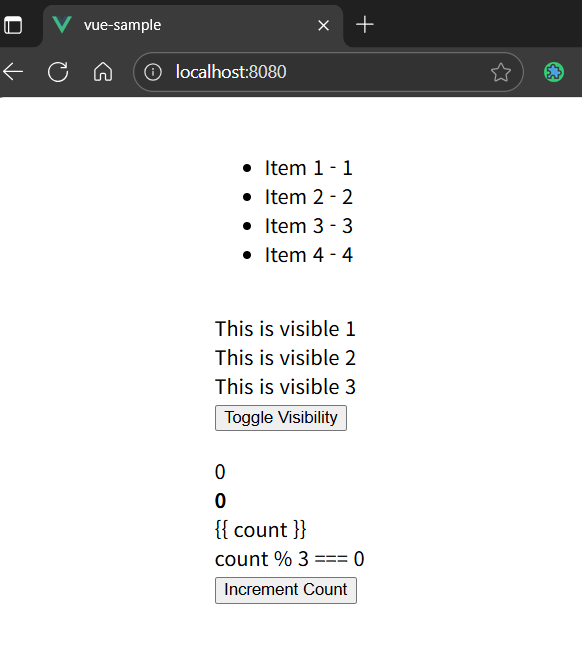
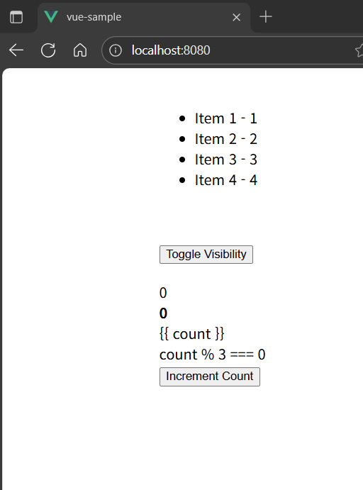
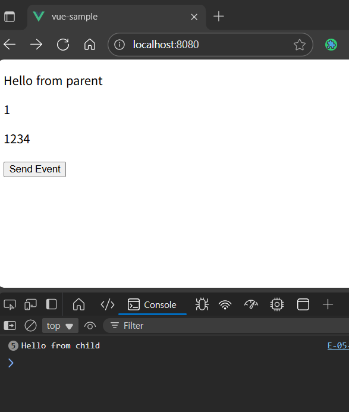
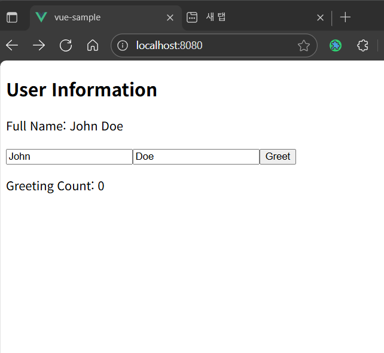
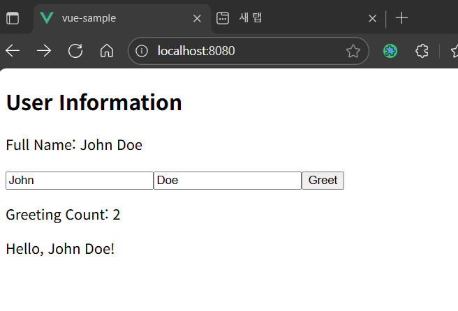
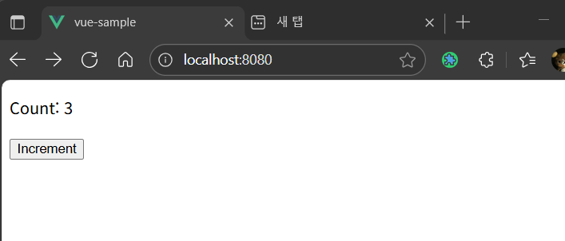
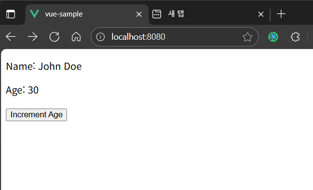

# Vue 2 → Vue 3

Vue 2를 Vue 3 스타일로 전환

---

## E-01-instance.vue

### １. 핵심 변경 사항

| 구분 | Vue 2 (Options API) | Vue 3 (Composition API)                           |
| :--- | :--- |:--------------------------------------------------|
| 스크립트 선언 | `export default { ... }` | `<script setup>`                                  |
| 반응형 상태 | `data() { return { ... } }` | `const name = ref(...)`                           |
| 컴포넌트 이름 | `name: "E01Instance"` | (파일 이름으로 정의)                                      |
| 상태 초기화 | `const name = ...` `return { message: name }` | `const name = ...` `const message = ref(name)` |

### 2. 확인 스크린샷

---
## E-02-reactive.vue

### １. 핵심 변경 사항

| 구분 | Vue 2 (Options API) | Vue 3 (Composition API) |
| :--- | :--- | :--- |
| 반응형 상태 | `data() { return { ... } }` | `const name = ref(...)` |
| 계산된 속성 | `computed: { fullName() }` | `const fullName = computed(...)` |
| 라이프사이클 | `mounted() { ... }` | `onMounted(() => { ... })` |
| 값 접근 (Script) | `this.firstName` | `firstName.value` |

### 2. 동작 확인용 스크린샷

| 초기 로드 (0s) | 1초 후 | 2초 후 (최종) |
| :---: | :---: | :---: |
|  |  | 

---

## E-03-binding.vue

### １. 핵심 변경 사항

| 구분 | Vue 2 (Options API) | Vue 3 (Composition API)                       |
| :--- | :--- |:----------------------------------------------|
| 반응형 상태 | `data()` 훅에서 객체로 반환 | `import { ref } from 'vue'` 개별 `ref()`로 선언 |
| `v-model` | 템플릿에서 `data` 속성 바인딩 | 템플릿에서 `ref` 변수 바인딩                            |
| 이벤트 핸들러 | `this.message = ...` (`this`로 `data` 접근) | `message = ...` (`ref` 변수에 직접 접근)          |
| 값 접근 (Script) | `this.id`, `this.password` | `id.value`, `password.value`                  |

### 2. 확인 스크린샷

|          초기 상태          |      'whoami' 클릭 후       |
|:-----------------------:|:------------------------:|
|  |   |

---

## E-04-Directives.vue

### １. 핵심 변경 사항

| 구분 | Vue 2 (Options API) | Vue 3 (Composition API) |
| :--- | :--- | :--- |
| 반응형 상태 | `data()` 훅에서 `isVisible`, `items`, `count`를 객체로 반환 | `import { ref } from 'vue'` `isVisible`, `items`, `count`를 `ref()`로 개별 선언 |
| 템플릿 구문 | `v-if="isVisible"`, `@click="count++"` 등 (암시적으로 `this`의 `data` 속성 참조) | `v-if="isVisible"`, `@click="count++"` 등 (Top-level `ref` 변수 직접 참조) |
| 스크립트 선언 | `export default { ... }` | `<script setup>` |

### 2. 확인 스크린샷

|  초기 상태   | Toggle 클릭 (Visible: false) | Count 증가 (Count: 5, Visible: false) |
| :---: | :---: |:-----------------------------------:|
||  |              |

---

## E-05-ParentComponent.vue

### １. 핵심 변경 사항

| 구분 | Vue 2 (Options API) | Vue 3 (Composition API - `setup()` fn) |
| :--- | :--- | :--- |
| API 스타일 | `data()`, `methods:` 옵션 사용 | `setup()` 함수 내에서 로직 정의 |
| 반응형 상태 | `data() { return { ... } }` | `import { ref }` `const parentMessage = ref(...)` |
| 메서드/핸들러 | `methods: { handleEvent(...) }` | `const handleEvent = (...) => { ... }` |
| 템플릿 바인딩 | `data`, `methods`가 템플릿에 자동 노출 | `setup()`에서 `return`하는 객체만 템플릿에 노출 |

### 2. 확인 스크린샷

|           초기 화면           |   이벤트 버튼 클릭 후 (콘솔)        |
|:-------------------------:|:-------------------------:|
|  |  |

---
## E-05-ChildComponent.vue

### １. 핵심 변경 사항
| 구분 | Vue 2 | Vue 3  |
| :-- | :--- | :--- |
| 이벤트 선언 | `$emit`을 템플릿에서 바로 사용 | `emits: ['custom-event']` |

### 2. 확인 스크린샷

|           초기 화면           |   이벤트 버튼 클릭 후 (콘솔)        |
|:-------------------------:|:-------------------------:|
|  |  |

---

## E-06-ParentComponent.vue

### １. 핵심 변경 사항

| 구분 | Vue 2 (Options API) | Vue 3 (Composition API) |
| :--- | :--- | :--- |
| 종속성 주입 | `provide` **옵션**을 함수형으로 선언 | `import { provide }` **함수**를 가져와 직접 호출 |
| 선언 방식 | `provide() { return { ... } }` | `provide('sharedMessage', '...')` |
| 자식 컴포넌트 | `import` 후 `components: { ... }`에 명시적 등록 | `import` 만으로 템플릿에서 자동 등록 |
| 스크립트 선언 | `export default { ... }` | `<script setup>` |

### 2. 확인 스크린샷

---

## ChildComponent1.vue

### １. 핵심 변경 사항

| 구분 | Vue 2 (Options API) | Vue 3 (Composition API) |
| :--- | :--- | :--- |
| 종속성 주입 | `inject: ['sharedMessage']` **옵션** 사용 | `import { inject }` **함수**를 가져와 직접 호출 |
| 선언 방식 | `inject: ['sharedMessage']` | `const sharedMessage = inject('sharedMessage')` |
| 자식 컴포넌트 | `import` 후 `components: { ... }`에 명시적 등록 | `import` 만으로 템플릿에서 자동 등록 |
| 스크립트 선언 | `export default { ... }` | `<script setup>` |

### 2. 확인 스크린샷

---

## ChildComponent2.vue

### １. 핵심 변경 사항

| 구분 | Vue 2 (Options API) | Vue 3 (Composition API) |
| :--- | :--- | :--- |
| 종속성 주입 | `inject: ['sharedMessage']` **옵션** 사용 | `import { inject }` **함수**를 가져와 직접 호출 |
| 선언 방식 | `inject: ['sharedMessage']` | `const sharedMessage = inject('sharedMessage')` |
| 스크립트 선언 | `export default { ... }` | `<script setup>` |

### 2. 확인 스크린샷

---

## E-07-OptionsApi.vue

### １. 핵심 변경 사항

| 구분 | Vue 2 (Options API) | Vue 3 (Composition API) |
| :--- | :--- | :--- |
| API 스타일 | `data`, `computed`, `methods`, `watch` 등 옵션으로 분리 | `setup()` 함수 내에 모든 로직을 함수형으로 통합 |
| Props | `props: { ... }` 옵션 | `setup(props)`의 첫 번째 인자로 `props`를 받음 |
| 반응형 상태 | `data() { return { ... } }` | `import { ref }` `ref()`를 사용해 개별 변수 선언 |
| 계산된 속성 | `computed: { fullName() { ... } }` | `import { computed }` `const fullName = computed(() => ...)` |
| 메서드 | `methods: { greet() { ... } }` | `const greet = () => { ... }` |
| 감시자 | `watch: { greetCount(new, old) { ... } }` | `import { watch }` `watch(greetCount, (new, old) => ...)` |
| 라이프사이클 (생성) | `beforeCreate()`, `created()` | `setup()` 함수 본문이 `beforeCreate`, `created`를 대체 |
| 라이프사이클 (마운트) | `beforeMount()`, `mounted()` | `import { onBeforeMount, onMounted }` `onBeforeMount(() => ...)` |
| 라이프사이클 (업데이트) | `beforeUpdate()`, `updated()` | `import { onBeforeUpdate, onUpdated }` `onBeforeUpdate(() => ...)` |
| 템플릿 바인딩 | `data`, `computed`, `methods`가 자동 노출 | `setup()`에서 `return`하는 객체만 템플릿에 노출 |
| `this` 접근 | `this.firstName`, `this.greet()` | `firstName.value`, `greet()` ( `this` 없음) |

### 2. 확인 스크린샷

|          초기 상태          | 'Greet' 클릭 (1회) | 'Greet' 클릭 (3회, watch 동작) |
|:-----------------------:|:---------------:|:-------------------------:|
|  |                 |                           |

---
아래부터는 제공된 예제가 Vue3 기반 코드, 스타일이므로 동작 확인용 스크린샷만 첨부하였습니다.

## E-08-composition-api.vue

### 동작 확인용 스크린샷

---

## E-09-composition-API2.vue

### 동작 확인용 스크린샷

---

## E-10-ref.vue

### 동작 확인용 스크린샷

---

## E-11-reactive.vue

### 동작 확인용 스크린샷

---

## E-12-ref-component.vue

### 동작 확인용 스크린샷

---